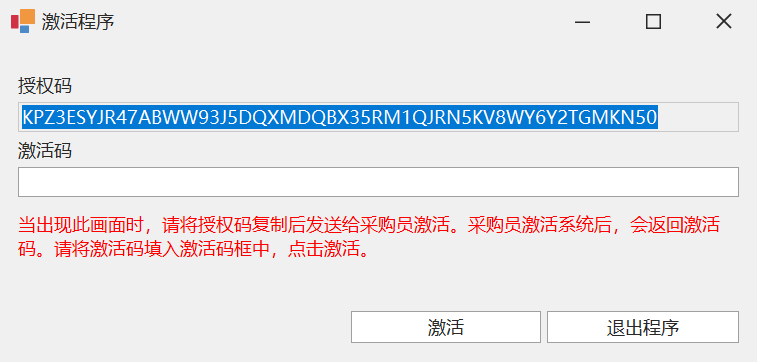
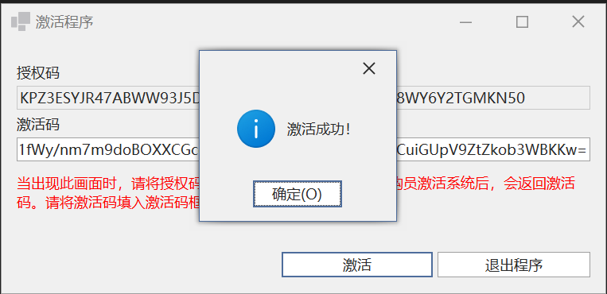
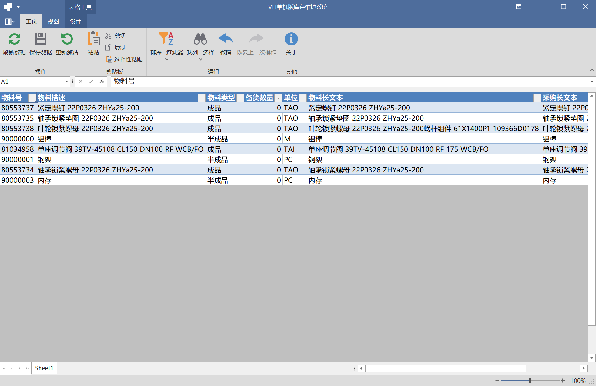
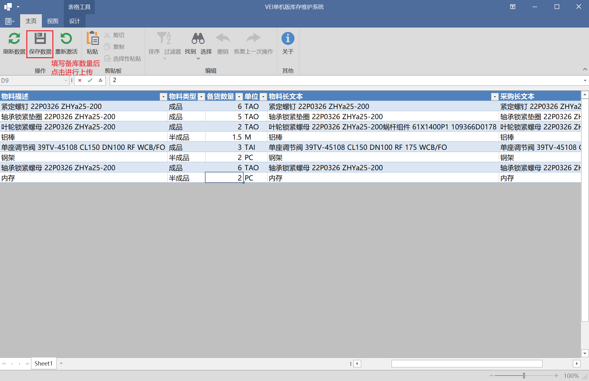
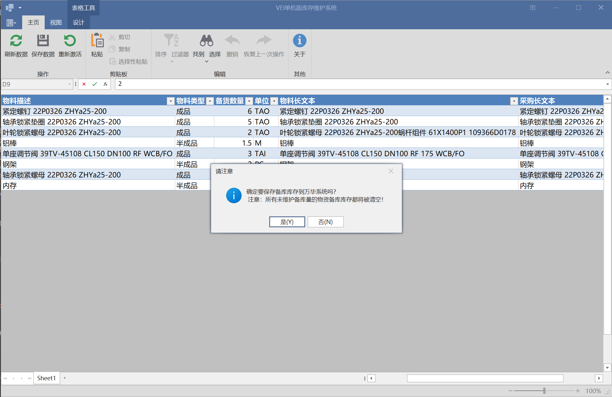
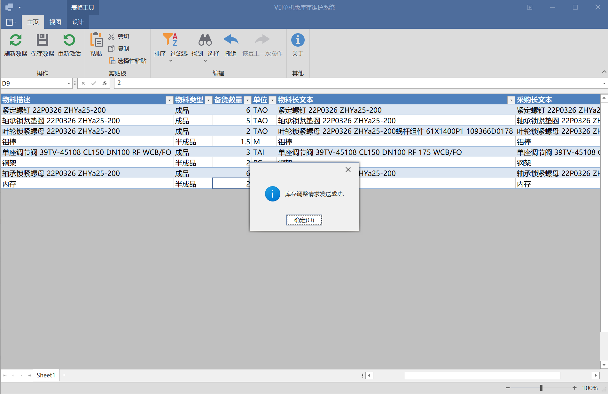

# 单机版
## 单机版说明
单机版适用于供应商没有系统，或系统中难以获取为万华备货的库存等无法通过系统对接的场景。使用单机版需要定期（由采购员指定）整理备货物资的最新情况，操作单机版系统上传至至万华系统。如果超过采购员指定的有效周期，则之前所有发送的备货信息都将被设置为无效库存，不参与VEI需求平库。

## 安装方法
下载指定环境的安装包
* [测试环境](https://oss.jcdev.cc/WH_Vei_Offline_Test.zip)
  * 测试环境用于测试目的，用于验证单机版的有效性及了解对接详细操作之用。
* [生产环境](https://oss.jcdev.cc/WH_Vei_Offline_Release.zip)
  * 生产环境是与万华系统对接的应用，**请务必不要在生产环境进行测试，或发送测试数据。**

下载成功后双击安装程序进行安装，当安装成功后，在桌面上将看到"VEI单机版"图标{width=60px style="display:inline-block"}，双击即可执行程序：

## 激活应用
当出现下面两种情况时，需要首先激活程序才能使用：
* 首次安装
* 重装系统或升级硬件
  
当运行程序时，将弹出激活对话框，如图：

复制授权码框的内容，将其发送给采购员，等待采购员完成激活操作。
<mark>等待时间较长，此时可以先退出程序</mark>

### 激活应用
当采购员完成后端激活操作后，会把激活码发送给供应商。在接收到采购员发送的激活密钥后，再次打开应用程序，将激活码复制到激活码框。点击"激活"按钮，如果返回激活成功，应用会重新启动，启动后即可正常操作。如果激活发生任何异常，请将错误反馈给采购员处理。

## 使用单机版
### 获取备货清单
打开单机版程序，默认将获取可备货物资清单。你也可以点击`刷新数据`按钮，随时更新备货物资清单

备货清单的内容如下：
* **物料号**：万华内部物料号
* **物料描述**：物料的描述信息
* **物料类型**： `成品`表示该物资是万华采购的成品或可作为成品备库的物资；`半成品`表示万华允许作为半成品备库的物资。当成品备货量不足时，采购员会参考半成品的备货情况，并根据物资需求的紧急程度来选择供应商
* **备货数量**：由供应商录入的此次备货的数量，必须为正有理数，保留三位小数。
* **单位**：物资备货的单位，注意此处单位未必是最终采购订单的单位。请按备货单位进行备货。
* **物料长文本**：物料的详细信息，包括规格等数据，用于明确确定采购物资的各种信息。
* **采购长文本**：采购人员针对该物资的其他特殊要求

<mark>注意：除备货数量外，其他所有字段都不可编辑，同时也不能新增或删除备货清单。</mark>
  
### 上传备货数据
根据备货清单整理所有物资的备货数量后，请将备货数量填入应用中，并点击“保存数据”按钮完成上传作业。

数据发送给万华系统后，系统会对数据进行检查，如果有任何的问题会弹出对话框显示具体的错误信息。如果发生未知错误，请与采购员联系处理。

<mark>应用的操作类似Excel，可以在Excel整理后将备货数量整体复制。</mark>

<mark>请将所有物资的备库数量全部整理好上传。上传备库数量为零的物资，系统将清空备库库存，而不是保留剩余的备货量。</mark>

<mark>注意：单机版采购员会设置备库物资上传频率，如果超过指定的频率未传输，则所有备货物资会全部认为是无效物资，不会参与平库。但是单机版并不会提示该信息，请及时上传备货信息</mark>

