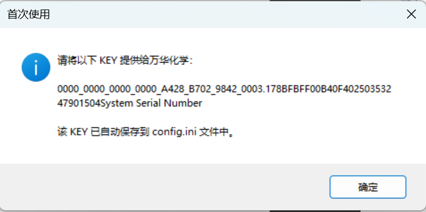
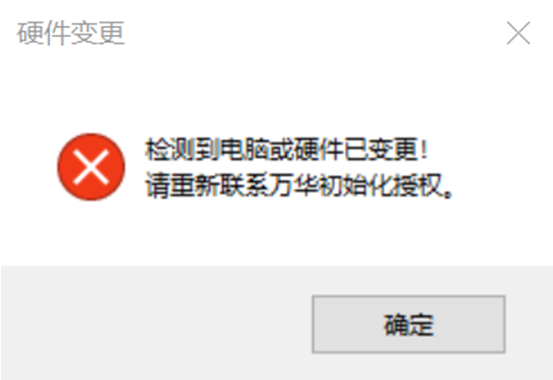
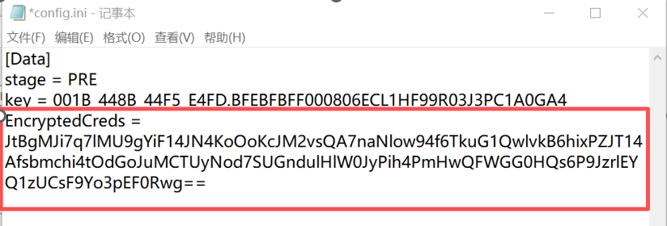
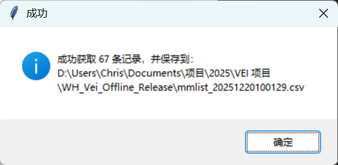
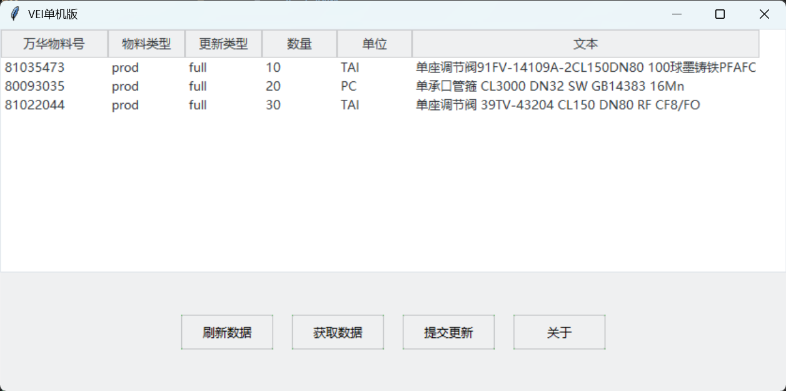
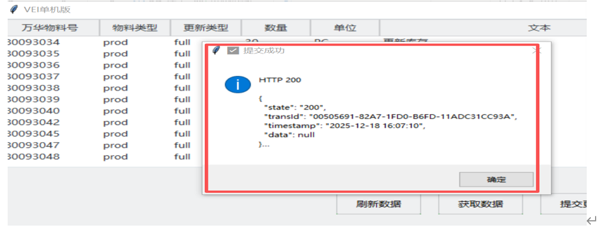

# 单机版
## 单机版说明
单机版适用于供应商没有系统，或系统中难以获取为万华备货的库存等无法通过系统对接的场景。使用单机版需要定期（由采购员指定）整理备货物资的最新情况，通过csv文件导入并发送至万华系统。如果超过采购员指定的有效周期，则之前所有发送的备货信息都将被设置为无效库存，不参与VEI需求平库。

## 安装方法
下载指定环境的安装包
* [测试环境](https://oss.jcdev.cc/WH_Vei_Offline_Test.zip)
  * 测试环境用于测试目的，用于验证单机版的有效性及了解对接详细操作之用。
* [生产环境](https://oss.jcdev.cc/WH_Vei_Offline_Release.zip)
  * 生产环境是与万华系统对接的应用，**请务必不要在生产环境进行测试，或发送测试数据。**

下载成功后解压缩，进入解压的目录，应该看到如下文件清单：

* **config.ini**：文件中保存配置信息，用于将您的PC与万华供应商信息做绑定，详情请查阅配置系统。
* **vei.csv**：文件用于批量上传库存信息，请用EXCEL打开该文件，将库存信息正确填入，详情请查阅运行系统。
* **gui.exe**：单机版执行文件

<mark>如果你的电脑上显示的没有后缀名，而是config,vei,gui三个文件，请不必担心，忽略后缀名即可。后续的帮助文档中提到的文件名，如打开config.ini，你只需要打开config即可。</mark>

## 配置环境
### 首次运行
首次运行程序时，请双击gui.exe，此时会提示进行硬件绑定，弹出对话框：

打开目录中的`config.ini`文件，将`key` 这一行的内容整个复制发送给采购员。等待采购员回复加密的激活密钥后，参考[激活应用](#激活应用)部分。
> 在采购员完成激活操作之前，不必再运行此程序。

### 重新安装
当电脑硬件升级，或者系统版本升级时，运行`gui.exe`文件会报错：

这表示单机版程序需要更新，请重新到本网站下载最新版的安装程序，并重复安装与配置过程以重新激活程序

### 激活应用
当接收到采购员发送的激活密钥后，请打开`config.ini`文件，将激活密钥复制到文件的最后。保存文件后，运行`gui.exe`文件。如果程序正常进入表示激活成功，如果报错请联系采购员处理。

最终`config.ini`文件看起来如下图：

<mark>注意需要另起一行复制，不要复制到其他行的后面。</mark>

## 使用单机版
### 获取备货清单
打开`gui.exe`程序，点击`获取数据`按钮，应用会弹出对话框告知得到的物料清单行数和保存文件的位置，请记下该文件名。

到应用目录下，双击打开对话框提示的数据文件，<mark>选择Excel或WPS打开</mark>，可以看到万华允许备货的物资清单。备货清单的内容如下：
* **物料编码**：万华内部物料号
* **物料描述**：物料的描述信息
* **删除标志**：表示万华是否已不允许供应商再备货该物资。如果为FALSE表示可以备货，如果为TRUE表示万华已不接受该物资的备货。但已删除的物资仍可以提报备货数量，当万华恢复与贵方对该物资的合作后，会立刻使用之前提报的备货数量。
* **长物料描述**：物料的详细信息，包括规格等数据，用于明确确定采购物资的各种信息。
* **采购长物料描述**：采购人员针对该物资的其他特殊要求
* **单位**：物料的备货单位，注意这有可能不是万华对该物资的采购单位，请按备货单位进行备货。
* **物料类型**： `prod`表示是供货的成品；`semi`表示万华同意备货的半成品物资。当成品备货量不足时，采购员会参考半成品的备货情况，并根据物资需求的紧急程度来选择供应商
  
### 上传备货数据
根据备货清单整理所有物资的备货数量后，打开目录下的`vei.csv`文件，<mark>选择Excel或WPS打开</mark>。将备货信息填入`vei.csv`文件中，保存该文件。  
`vei.csv`文件的内容如下：
* **万华物料号**：此处填入备货清单中的**物料编码**
* **物料类型**：此处填入备货清单中的**物料类型**。注意一定不要填错物料类型，或者填写了除`prod`和`semi`外的其他数据
* **更新类型**：必须填入`full`，不要填写其他内容。
* **数量**：备货的数量，必须为正有理数，保留三位小数。
* **单位**：此处填入备货清单中的**单位**
* **文本**：可选，填入一个备注信息

填写`vei.csv`文件的样例如下：

保存`vei.csv`文件后，打开目录下的`gui.exe`应用。点击“刷新数据”按钮，应用将从`vei.csv`文件中获取本次要上传的备货数据，并显示到页面上。

确认要上传的数据是否正确，如果没有问题后，点击“提交更新”按钮，将数据发送给万华系统。  
数据发送给万华系统后，系统会对数据进行检查，如果有任何的问题会弹出对话框显示具体的错误信息。

如果上传成功，会显示如下对话框：

<mark>注意：单机版采购员会设置备库物资上传频率，如果超过指定的频率未传输，则所有备货物资会全部认为是无效物资，不会参与平库。但是单机版并不会提示该信息，请及时上传备货信息</mark>

