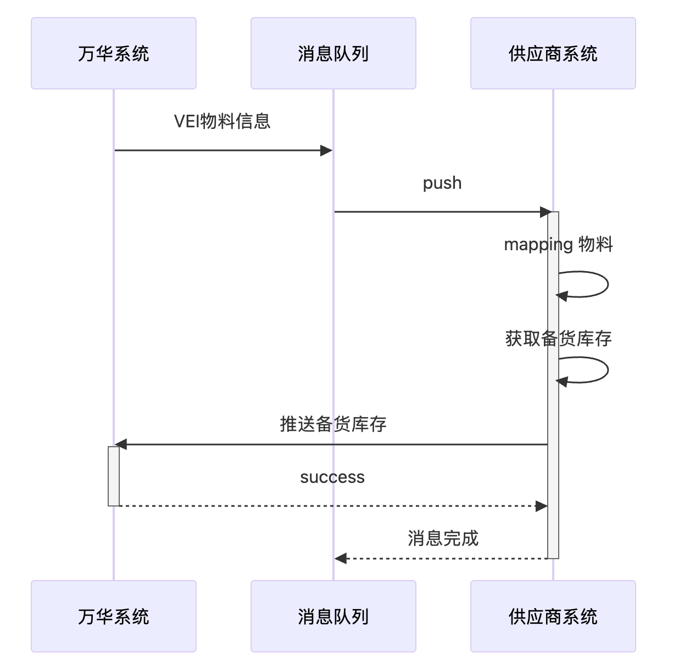

# 对接方案
## 对接方法
供应商生态库存（VEI）的系统对接有两种方式
- 万华测向供应商测发送数据
- 供应商侧调用接口向万华发送数据

[联机版 Demo 下载](https://oss.jcdev.cc/WH_VEI_Online_Demo.zip)

### 万华向供应商发送数据
当万华业务流程中产生的数据需要主动推送给供应商时，会使用下述的方案实现数据的发送。  
万华会将数据发送至云消息队列中间件，供应商订阅自己供应商编号对应的队列。当消息产生后，消息服务器会主动将消息发送给供应商。

#### rabbitMQ
rabbitMQ 是开源的消息队列中间件，负责实现消息的接收、转发与存储。

### 供应商向万华发送数据
当供应商业务流程中产生的数据需要发送给万华，或者需要主动从万华系统获取相关信息时，可以通过该方式进行交互。  

## 对接场景
### 物料主数据同步
当万华与供应商签署 VEI 框架合同后，合同内约定的物料信息将由万华系统分发至供应商系统。同时，当发生下述场景时，物料信息也会推送至供应商：
- 框架合同新增物料
- 物料维护了半成品组件信息
- 物料描述信息发生变更

#### 系统对接泳道图

##### VEI物料信息推送
当万华向消息队列推送了物料相关信息后，供应商应当获取该消息进行处理。点击查看数据详细格式
##### maping物料及计算备货库存

##### 推送备货库存