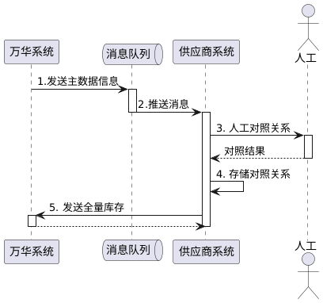
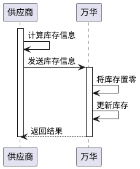
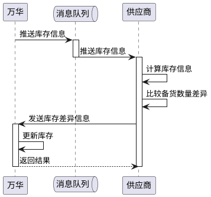

# 联机对接规范

## 设计原则
联机版对接项目的设计原则是实现供应商产品与万华需求的共享与分配。因此我们聚焦将万华的需求物资下发给供应商，以及将供应商的库存同步给万华这两个业务上。我们不会涉及后续如订单、流程、运输、收货等业务的联动。因此，请不要在系统实现时，考虑与贵方其他任何系统业务的联动。

同时，对接系统在设计时，我们也充分考虑了系统间的解耦合，双方系统之间没有任何紧密耦合的关系。因此，请在系统实现时，不要设计供应商业务场景依赖万华某业务的系统。

第三，对接系统充分考虑未来的向后兼容性，我们会在后续的工作中持续更新，但是会尽量确保原来已对接的供应商无需立即配合更新才能使用。

[联机版 Demo 下载](https://oss.jcdev.cc/WH_VEI_Online_Demo.zip)
供应商选择联机版对接方案，需要按本篇介绍的规范与将供应商的系统与万华系统进行对接。请通读本篇，了解详细的对接规范后，再进行供应商端系统的设计与修改。


## 对接规范
在进行系统开发前，请先阅读业务指南，详细了解VEI对接的目的。然后再阅读此部分，详细了解场景的设计原则与对接的目的。  
在向后阅读前，我们假设您已经了解VEI业务的规则，并已了解为何需要进行系统对接及对接的收益。  

VEI系统在供应商联机对接上，一共设计了下面三个业务场景。
1. 万华采购物资与供应商销售物资的关联
2. 万华采购需求推送供应商
3. 供应商库存与万华共享

### 双方物资关联
建立物资主数据的一致性关联是双方系统对接的首要前提。通过打通底层编码体系，才能确保双方在采购需求同步、库存实时共享及订单锁定等核心业务逻辑上实现语义对齐与无缝协同。  
主数据的关联工作是在供应商系统内完成。万华系统会将所有与供应商合作的采购物资信息下发给供应商系统，由供应商系统完成对照与关联工作。该业务场景可以由系统自动完成，也可以由人工完成对照。请务必确保关联关系是正确的。

在发生下面的情景时，万华系统会将对应物资发送给供应商，完成双方系统物资关联工作。
* 双方签署新的框架合同后，将框架合同中的物资信息发送给供应商
* 在框架合同约定的范围内，产生了新的需供货的物资，将这部分新增物资信息发送给供应商

<mark>万华的物资一物一码，不会在后续的工作中变更物料号与实物的对应关系。</mark>

供应商系统接收到万华的物料清单后，需完成万华物料与供应商物料的对照关系，需确保双方物资是一对一的对照关系，严禁出现一方的一个物料对应另一方多个物料的情形。  
通常对照的工作是在线下由人工完成，亦可通过自动化或AI手段实现自动对照，但需要人工进行审核。对照完成后，请将对照关系保存在供应商系统内，便于后续业务场景的进行。  
<mark>双方系统对接时，物资的物料号统一使用万华的物料号，万华不会存储、管理或维护供应商的物料号，也不会管理双方物资的对照关系。</mark>

#### 泳道图
双方物资关联业务的泳道图如下：



1. 发送物料主数据信息：仅上方描述的两个场景会发送主数据信息，其他情况不会发送。因此供应商必须将万华的主数据信息保存
2. 推送消息：消息队列保存消息的有效期为1天，超时会删除，请确保系统长期接入消息队列
3. 人工对照关系：此处亦可使用AI等工具自动对照，但必须由人工确认，保证对照关系精准
4. 存储对照关系：对照关系必须由供应商系统存储，后续所有对接场景都使用万华物料进行传输。万华系统不保存供应商的物料，也不保存双方对照关系。
5. 发送全量库存：当队列取到的数据中`fullInventory: true`时，在对照关系建立好之后，请立刻将该物料的备库库存发送给万华系统

### 万华采购需求推送供应商
当万华产生了采购需求，并且系统分配了某供应商供货时，该供应商将收到消息队列发出的锁定消息。同时，如果系统取消了该供货单据，会发送解锁消息通知供应商。

供应商收到消息后，有下面两种处理方式，请选择其中一种进行处理。

#### 仅通知
选择仅通知这种对接方案时，如果收到了锁定或解锁的消息，请将该消息以待办或通知的方式告知相关方（如销售岗，库管岗，发货岗）。系统不必对该消息进行任何的后续处理。

#### 锁定库存并通知
选择锁定库存并通知的对接方案时，如果收到了锁定消息，需要将该物资指定数量的库存发送到万华专有锁定库或万华专有库存地点保存。当万华下达采购订单后，创建对应的销售订单进行发货，发货时将万华专有的锁定库存或库存地点中的库存进行销售发货。  
如果收到的时取消锁定消息，则将已经发送到万华专有的锁定库或库存地点的库存重新转回备库库存。

除上述作业外，需要将锁定和解锁消息发送给相关方，告知其进行后续动作。

当万华对锁定的需求进行下单时，仅会通过邮件通知供应商的销售人员，不会在系统中发送下单信息。因此，不要在系统中做下单业务的关联，也不要考虑通过锁定单据与下单单据的关联来实现其他业务。

### 供应商库存共享
供应商系统需要及时的将备库库存发送给万华，以便万华系统可根据供应商的备库信息进行锁定与下单操作。

万华系统保存的供应商库存包括备库数量和锁定数量。其中备库数量表示供应商当前库存中可用于销售的数量，而锁定数量表示万华已锁定准备进行下单的数量。

* **备货数量**由供应商系统实时同步给万华系统。  
* **锁定数量**由万华系统控制，供应商系统无法修改。锁定数量同时也是[万华采购需求推送供应商](#万华采购需求推送供应商)部分中，所有该物资锁定数量的合计。

为了保证系统的健壮性，当万华系统对锁定业务进行下单时，会同时条件备货数量与锁定数量。比如供应商备货数量为20个，此时万华锁定了5个，那么当万华下单了5个时，会在万华端将备库数量调整为15个，锁定数量为0个。与此相应的，当万华取消了订单时，也会相应的调整备货数量。

供应商向万华推送备库数量的方式有如下三种，请选择其中一种进行推送。

#### 定时全量同步
定时全量同步法要求供应商定时将所有关联好的物资的全部备库库存同步给万华，万华系统会刷新存储在万华端的备库数量。  
使用这种方法同步库存时，不需要接收万华推送的库存信息，只需按供应商系统的节奏，将库存数据发送至万华。  
由于万华系统在下单时会减少供应商备库数量，但是供应商只有发货时才会减少，因此双方系统在这个时间会出现数量差。将供应商的库存数据同步给万华会造成数据的虚高，请确保留有一定的安全库存，确保不会出现无法供货的情形。<mark>如因此同步方式造成库存不足无法供货，则由供应商承担损失。</mark>

##### 时序图


发送库存信息时，使用全量库存同步方式

```json
{
  "type": "API_VEI_STOCK_MOVE",
  "timestamp": "2026-02-03 09:09:30",
  "data": {
    "items": [
      {
        "matType": "prod",
        "material": "80005643",
        "moveType": "full",
        "quantity": "1",
        "unit": "PC"
      },
      {
        "matType": "prod",
        "material": "80005644",
        "moveType": "full",
        "quantity": "2",
        "unit": "PC"
      }
    ],
    "olUuid": "uuid",
    "vendor": " 供应商编号"
  }
}

```


#### 定时差异同步
定时差异同步方式是每日获取到万华系统推送的供应商库存消息后，比较双方库存的差异，将差异量通过库存变更接口提交给万华系统。使用这种方式同步时，必须使用[锁定库存并通知](#锁定库存并通知)方式处理万华推送的采购需求。

当接收到万华发送的库存信息时，首先计算物资备库数量：
$$
物料备库数量 = 备库数量（供应商系统） + 万华锁定数量（万华系统推送的锁定数量lockQuantity）
$$
然后将该数量与万华返回的库存数量（quantity）进行比较，计算出差量更新至万华。

举个例子：接收到万华推送的库存信息如下：
```json
{
  "material": "some material",
  "type": "prod",
  "quantity": 10,
  "validQuantity": 4,
  "lockQuantity": 6,
  "unit": "PC"
}
```
此时供应商系统里，该物料的库存量是 9PC（排除了万华专有的锁定数量）。此时根据公式$物料备库数量 = 备库数量（供应商） + 锁定数量（万华）$计算可得，$备库数量 = 9 + 6 = 15 \text{PC}$。而万华推送的库存数量为 10。因此$差异量 = 15 - 10 = 5\ \text{PC}$，此时调用库存同步接口，将 5 个差异量提交万华即可。

##### 泳道图


库存计算逻辑如上，在发送库存时，注意根据差异的正负，标记调增或调减。  
当差异为正，供应商处库存更多，此时调增库存。
```json
{
  "type": "API_VEI_STOCK_MOVE",
  "timestamp": "2026-02-03 09:09:30",
  "data": {
    "items": [
      {
        "matType": "prod",
        "material": "80005643",
        "moveType": "increase",
        "quantity": "5",
        "unit": "PC"
      }
    ],
    "olUuid": "uuid",
    "vendor": " 供应商编号"
  }
}
```

当差异为负，供应商处库存较少，此时调减库存
```json
{
  "type": "API_VEI_STOCK_MOVE",
  "timestamp": "2026-02-03 09:09:30",
  "data": {
    "items": [
      {
        "matType": "prod",
        "material": "80005643",
        "moveType": "decrease",
        "quantity": "5",
        "unit": "PC"
      }
    ],
    "olUuid": "uuid",
    "vendor": " 供应商编号"
  }
}
```

#### 实时差异同步
实时差异同步方式是指，当供应上处库存发生变化时，即发送变化数据到万华，更新万华的备库库存。这种方式适合供应商系统库存非常准确，是最为推荐的方式。

值得注意的是，如果使用[仅通知](#仅通知)的方式处理万华的需求，则备库量和万华锁定和下单的数量是合计在一起的。由于万华会分开处理备库量与锁定量，且下单时会响应减少供应商的备库量，如果供应商在发货给万华时将这个库存变化也同步给万华，会造成万华系统中的备货数量虚低（备库数量被万华系统和供应商系统各减少了一次）。因此：
> 在同步差异量时，发货给万华的单据不要提交给万华系统

如果使用[锁定库存并通知](#锁定库存并通知)的方式处理万华需求，那么备库量和万华专有库存会分别存储。此时同步差异只需考虑备库量的变化即可。

由于实时差异同步方式供应商和万华各自处理各自系统的库存变化，因此无需等待万华下发的库存信息。


