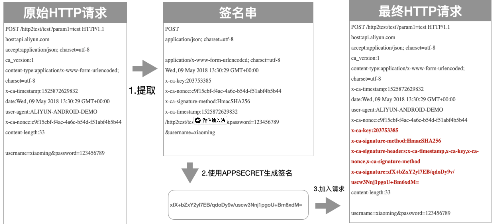

# 技术文档
## 技术架构
为实现万华系统与供应商系统的解耦，此次对接功能在设计上不再仅使用 api 对接的方式。当万华需要向供应商推送数据时，我们会使用消息队列服务作为中间件，将数据暂存在消息队列中。当供应商接入消息队列时，才会从队列上获取最新的数据进行处理。

使用消息队列作为中间件有如下优点：
* 系统解耦：万华系统与供应商系统并不直接连接，而是由消息队列中间件来实现。因此双方系统将大量减少耦合性。
* 削峰填谷：大量的 api 接口调用可能会产生延迟和等待，而使用消息队列则双方系统都无需等待
* 消息存储：如果消息发送失败，api 会丢失该消息，或者发送系统不得不回滚自己的事务。而使用消息队列会将消息保存下来，待下次访问处理。
* 消息幂等：消息上有唯一的消息号码，确保消息不会重复。
* 消息状态：消息有状态，只有被成功消费的消息才会删除，如果处理失败可以重新获取处理，或者推送到死信队列通知万华

### 万华向供应商发送数据
当万华业务流程中产生的数据需要主动推送给供应商时，会使用下述的方案实现数据的发送。  
万华会将数据发送至云消息队列中间件，供应商订阅自己供应商编号对应的队列。当消息产生后，消息服务器会主动将消息发送给供应商。

#### rabbitMQ
rabbitMQ 是开源的消息队列中间件，负责实现消息的接收、转发与存储。

### 供应商向万华发送数据
当供应商业务流程中产生的数据需要发送给万华，或者需要主动从万华系统获取相关信息时，可以通过该方式进行交互。  

## 消息队列
### 环境配置
消息队列服务包含测试与生产两个环境。

#### 测试环境
测试环境主要用于供应商系统与万华系统进行联调使用。  
供应商系统在进行对接开发，或者接口进行了新增、修改等任何需要联调测试的场景时：
1. **新供应商对接**：若是首次对接，需要向万华申请测试环境的专属队列、账号、密码。请牢记并妥善保存相关信息。如遗失或需要重置，请联系万华相关接口人。
2. **新增或修改接口**：因业务发生调整，需要新增或修改原有接口时，各供应商需配合万华在测试场景进行联调测试，确保系统切换时业务场景稳定运行。

##### 测试环境信息
| 环境变量 | 值 |
| --- | --- |
| Host | 121.36.58.218 |
| Port | 5671 |
| vHost | vei |
| SSL | 必需 |
| 队列名称 | 各供应商的供应商编号 |
| 账号 | 需申请 |
| 密码 | 需申请 |

#### 生产环境
生产环境是 VEI 对接业务的正式运行环境。仅当供应商在所有的对接接口中都成功完成了联调测试后，才会为其分配生产环境的队列及账号密码。
<mark>重要：绝不可以在生产环境或数据进行系统测试工作</mark>
##### 日志要求
生产环境必须保留运行时对接的数据日志，日志保留时间不低于一个月。日志必须包括以下部分：
* **接收到的数据**：需全量保存接收到的消息，格式为字符串。
* **执行结果**：对获取到的消息进行处理时，需要保存最终处理的结果，尤其是发生异常时的异常信息
* **退回消息数据**：当通知队列消息的 `ACK = false` 时，需要记录该消息的内容，格式为字符串，并需要记录返回消息队列的具体时间


##### 生产环境信息
| 环境变量 | 值 |
| --- | --- |
| Host | 121.36.58.218 |
| Port | 5671 |
| vHost | vei |
| SSL | 必需 |
| 队列名称 | 各供应商的供应商编号 |
| 账号 | 需申请 |
| 密码 | 需申请 |

### 消息格式
传输给供应商的数据统一发送到以供应商编号命名的队列中。当供应商申请对接成功后，会为其在消息队列中创建其专属的队列。  
当消息发送至队列时，会附带 routing_key。routing_key 是由小写字母、数字、连接符"-"组成的，用于辨识消息功能的识别码。详情请参考 rabbitMQ 官方网站。routing_key 的格式为"destination.model.action"，其中：
* destination：消息的目的地，此处为供应商编号
* model：消息对应的模型，如物料主数据为 master-data。
* action：行为，表示该消息由什么行为触发。比如 sync 表示由同步行为触发

消息体为 JSON 对象格式保存的数据。详细内容如下：

| 字段名 | 描述 | 数据类型 | 详细信息 |
| --- | --- | --- | --- |
| msgId | 消息编号 | string | uuid 格式的消息编号 |
| msgType | 消息类型 | string | 标识消息的含义 |
| source | 消息源 | string | 发送消息的源系统 |
| version | 版本 | string | 版本号，当前为 v1 |
| traceId | 消息跟踪号 | string | uuid 格式的跟踪号，请记录到日志中，用于分析 |
| timestamp | 时间戳 | datetime | 消息发送时间，格式为 ISO 标准时间，时区为 UTC |
| body | 消息内容 | json string | json 格式的数据，每个消息内容不同 |

参考样例
```json
{
  "msgType": "master-data-sync",
  "source": "sap",
  "version": "v1",
  "traceId": "00505691-82a7-1fd0-b6aa-8e675e89891b",
  "body": {
    "material": "80001553",
    "fullInventory": true,
    "materialDesc": "H型钢 194×150×6×9 GB11263 Q235B",
    "longText": "热轧普通碳素H型钢 194×150×6×9 GB/T11263 Q235B",
    "purLongText": "热轧普通碳素H型钢 194×150×6×9 GB/T11263 Q235B",
    "deleted": false,
    "unit": "M",
    "matType": "prod"
  },
  "msgId": "0e0cca8c-a1d0-45db-9f6a-977d75cfb3ba",
  "timestamp": "2025-12-15T01:21:58.235333Z"
}

```


## API 接口
### 环境配置
API 接口包括测试与生产两个环境
**测试与生产环境是通过 Http Header：X-Ca-Stage 进行区分的。如果未设置该消息头，默认会接入生产环境。因此请务必谨慎，确保不要接入错误的环境。**

| HTTP 参数 | 值 |
| --- | --- |
| Host | api.whchem.com |
| Port | 443 |
| Path | /MM/01622/purapi |
| TLS | 必需 |
| URL | https://api.whchem.com/MM/01622/purapi |
| Method | POST |
| 密钥 | 需申请 |

#### 测试环境
测试环境主要用于供应商系统与万华系统进行联调使用。  
供应商系统在进行对接开发，或者接口进行了新增、修改等任何需要联调测试的场景时：
1. **新供应商对接**：若是首次对接，需要向万华申请接入许可。请牢记并妥善保存相关信息。如遗失或需要重置，请联系万华相关接口人。
2. **新增或修改接口**：因业务发生调整，需要新增或修改原有接口时，各供应商需配合万华在测试场景进行联调测试，确保系统切换时业务场景稳定运行。

#### 生产环境
生产环境是 VEI 对接业务的正式运行环境。仅当供应商在所有的对接接口中都成功完成了联调测试后，才可接入生产环境。
<mark>重要：绝不可以在生产环境或数据进行系统测试工作</mark>
##### 日志要求
生产环境必须保留运行时对接的数据日志，日志保留时间不低于一个月。日志必须包括以下部分：
* **request**： 保存接口发送的所有数据信息，包括 Header 与 Body，接入地址等信息。
* **response**： 从服务端返回的数据信息，包括 Http status，Header，返回的正文等信息。


### 认证与授权
api 接口使用摘要签名认证的方式。
#### 前置条件
API的调用方需要在调用API之前获取到已经授权给对应API的签名密钥对：
* APP Key
* APP Secret

#### 签名生成简述

客户端生成签名一共分为三步：
1. 从原始请求中提取关键数据，得到一个用来签名的签名串。
2. 使用加密算法加APP Secret对关键数据签名串进行加密处理，得到签名。
3. 将签名所相关的所有头加入到原始HTTP请求中，得到最终HTTP请求。

与认证签名有关的消息头：

| 名称 | 作用 |
| --- | --- |
| x-ca-key | app key |
| x-ca-signature-method | hmac 加密算法，当前支持两种算法：<br>HmacSHA256<br>HmacSHA1 |
| X-Ca-Stage | 接入环境 <br> PRE 测试环境 <br>RELEASE 生产环境 |
| X-Ca-Signature-Headers | 逗号分隔的参与签名运算的自定义消息头名称拼接的字符串。如果只有 X-Ca-Stage 一个自定义头，只需填写X-Ca-Stage |
| X-Ca-Signature | 摘要签名的计算结果 |

#### 提取签名串
客户端需要从HTTP请求中提取出关键数据，组合成一个签名串，生成的签名串的格式如下：
```
HTTPMethod
Accept
Content-MD5
Content-Type
Date
Headers
PathAndParameters
```
以上 7 个字段构成整个签名串，字段之间使用\n 间隔，即使字段为空都需要保留\n。签名大小写敏感。下面介绍每个字段提取规则：
* HTTPMethod：HTTP 的方法，这里统一为 `POST`
* Accept：请求中的Accept头，这里统一为 `application/json`
* Content-MD5：这里统一使用空字符串，记住要保留\n
* Content-Type：请求中的Content-Type 头的值，统一设置为`application/json; charset=utf-8`
* Date：建议删除 Header 中默认的 Date 头，如果不删除，这里写 Date 头中的内容
* Headers：选取指定的header 参与签名，header 签名串拼接规则如下：
  * 参与签名计算的 Header按照 Key 的字典序排序后按如下方式拼接。
  ```
  HeaderKey1 + ":" + HeaderValue1 + "\n" + 
  HeaderKey2 + ":" + HeaderValue2 + "\n" +
  ...
  HeaderKeyN + ":" + HeaderValueN + "\n"
  ```
  * 如果Header 的 Value为空，则使用`HeaderKey + ":" + "\n"参与签名，需要保留 Key 和英文冒号。
  * 将所有参与签名计算的 Header 的 Key 的集合以逗号分隔拼接为字符串后，放到`X-Ca-Signature-Headers`中
  * 以下 Header不参与签名计算：X-Ca-Signature、X-Ca-Signature-Headers、Accept、Content-MD5、Content-Type、Date
* PathAndParameters 这个字段包含Path，QueryString中的所有参数，具体组织形式如下
  ```
  Path + "?" + Key1 + "=" + Value1 + "&" + ... + KeyN + "=" + ValueN
  ```
  * Path 为绝对路径，格式为/MM/01622/purapi，注意大小写
  * 如果 QueryString 为空，则直接使用 Path，不要加问号
  * QueryString 中所有参数按 Key 的字典序排序后进行上面的拼接
  * 参数的 Value 为空时，只保留 Key，等号不要参与签名
  * QueryString存在数组参数（Key 相同，Value 不同），取第一个 Value 参与计算

下面是签名串的例子
```
POST /MM/01622/purapi HTTP/1.1
host:api.aliyun.com
accept:application/json
ca_version:1
content-type:application/json; charset=utf-8
x-ca-timestamp:1525872629832
date:Wed, 09 May 2018 13:30:29 GMT+00:00
user-agent:ALIYUN-ANDROID-DEMO
x-ca-nonce:c9f15cbf-f4ac-4a6c-b54d-f51abf4b5b44
content-length:33
{
  "type": "API_HELLO_WORLD",
  "timestamp": "2025-12-19 08:50:30"
}
```

生成的正确的签名串为
```
POST
application/json

application/json; charset=utf-8
Wed, 09 May 2018 13:30:29 GMT+00:00
X-Ca-Stage:PRE
/MM/01622/purapi
```

#### 计算签名
加密算放当前支持两种：
* HmacSHA256
* HmacSHA1

使用 Hmac 算法，以App Secret 作为 Key，对前面生成的签名串进行加密，实例代码如下：
stringToSign 为签名串，ApiSecret 是 APP Secret

```CSharp
var hmac = new HMACSHA256(Encoding.UTF8.GetBytes(ApiSecret));
var signature = Convert.ToBase64String(hmac.ComputeHash(Encoding.UTF8.GetBytes(stringToSign)));
```
加密后的 signature 使用 Base64 算法生成 string即为最终签名

#### 传输签名
客户端需要将 4 个Header放在 HTTP 请求中传给网关进行签名校验：

| 名称 | 作用 |
| --- | --- |
| x-ca-key | app key 必须 |
| x-ca-signature-method | hmac 加密算法，当前支持两种算法：<br>HmacSHA256<br>HmacSHA1 <br>可选，默认值为 HmacSHA256|
| X-Ca-Signature-Headers | 逗号分隔的参与签名运算的自定义消息头名称拼接的字符串。如果只有 X-Ca-Stage 一个自定义头，只需填写X-Ca-Stage |
| X-Ca-Signature | 签名，必选 |

最终生成的HTTP 请求示例：
```
POST /MM/01622/purapi HTTP/1.1
host:api.aliyun.com
accept:application/json
content-type:application/json; charset=utf-8
date:Wed, 09 May 2018 13:30:29 GMT+00:00
X-Ca-Stage:PRE
x-ca-key:203753385
x-ca-signature-method:HmacSHA256
x-ca-signature-headers:X-Ca-Stage
x-ca-signature:xfX+bZxY2yl7EB/qdoDy9v/uscw3Nnj1pgoU+Bm6xdM=
content-length:33
{
  "type": "API_HELLO_WORLD",
  "timestamp": "2025-12-19 08:50:30"
}
```
#### 签名排错
如果是签名校验出错时，服务端会将签名串放到 Http 响应头中返回给客户端，Key 为：X-Ca-Error-Message。客户端可以鉴别下服务端计算的签名串与客户端是否有差异并进行修正。如果没有差异，那么看一下 APP Secret 传递的是否正确。

因为Http Header中无法表示换行，因此签名串中所有的换行符被替换成#
```
errorMessage:  Invalid Signature, Server StringToSign:`POST#application/json##application/json##X-Ca-Stage:PRE#/MM/01622/purapi`
```


### 数据格式

#### Request
Request Header 中务必指明对接的环境，即`X-Ca-Stage:PRE`表示测试，`X-CA-Stage:RELEASE`表示生产

api 接口传输的数据主要在 Body 中，Content-Type 为 application/json; charset=UTF-8

Request 请求的标准格式为

| 字段名 | 作用 |
| --- | --- |
| type | 接口的类型，请查阅接口清单，大小写敏感，必填 |
| timestamp | 接口调用时间，与服务器时间差的绝对值不超过 1min，格式为 yyyy-MM-dd HH:mm:ss <br>必填 |
| body | 接口需接收的数据，JSON 格式 |

示例

```
{
  "type": "API_VEI_STOCK_MOVE",
  "timestamp": "2025-12-19 09:38:30",
  "data": {
    "vendor": "6000170",
    "items": [
      {
        "material": "80155463",
        "matType": "prod",
        "moveType": "full",
        "quantity": 10
        "unit": "PC",
        "text": "备注"
      }
    ]
  }
}
```

#### Response
接口返回的消息格式为 Json，Accept 为 application/json

Response Body 的标准格式为

| 字段名 | 作用 |
| --- | --- |
| state | 执行的结果，如果是 200 表示成功，E 表示失败 |
| msgId | 返回的错误编号，仅 state = 'E'时返回 |
| msgText | 返回的错误文本，仅 state = 'E'时返回 |
| transId | 本次api 调用服务端产生的事务编码，可用来追溯结果 |
| timestamp | 接口返回时间，服务器的时间 |
| body | 接口返回内容，JSON 格式 |

返回示例
* 成功时
```json
{
    "state": "200",
    "transId": "00505691-82A7-1FD0-B78F-805F18AE4958",
    "timestamp": "2025-12-19 09:42:43",
    "data": [
        {
            "material": "81035473",
            "materialDesc": "单座调节阀91FV-14109A-2CL150DN80 100球墨铸铁PFAFC",
            "deleted": false,
            "longText": "单座调节阀 91FV-14109A-2 CL150 DN80 RF 100 球墨铸铁+PFA/改性PTFE FC %",
            "purLongText": "单座调节阀 91FV-14109A-2 CL150 DN80 RF 100 球墨铸铁+PFA/改性PTFE FC %单座调节阀 91FV-14109A-2 CL150 DN80 RF 100 球墨铸铁+PFA/改性PTFE FC %",
            "unit": "TAI",
            "matType": "prod"
        },
        {
            "material": "80093035",
            "materialDesc": "单承口管箍 CL3000 DN32 SW GB14383 16Mn",
            "deleted": false,
            "longText": "单承口管箍 CL3000 DN32 SW GB/T14383(Ia) 16Mn",
            "purLongText": "单承口管箍 CL3000 DN32 SW GB/T14383(Ia) 16Mn单承口管箍 CL3000 DN32 SW GB/T14383(Ia) 16Mn",
            "unit": "PC",
            "matType": "prod"
        }
    ]
}
```

* 失败时
```json
{
    "state": "E",
    "transId": "",
    "timestamp": "2025-12-19 09:49:42",
    "msgId": "ZA1002",
    "msgText": "服务器时间不同步或接口超时"
}
```
### 错误码字典